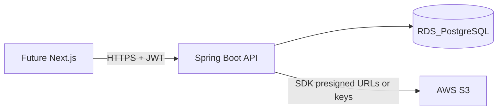

# Backend plan (living document)

This file is the **project plan** for the Islamic Learning Center API: architecture, API sketch, quality bar, and a **checklist** you can update as work progresses. Edit it in the repo so it travels with the code and stays visible in any chat or clone.

> The same plan may exist under Cursor’s internal plans path; **this copy in `docs/` is the one to change** for the team and for history in git.

## Progress checklist

Tick items as you finish (`[x]` = done). IDs match how we talk about work in issues and chats.

- [x] **skeleton-jpa** — Spring Boot 3 + Maven (`pom.xml`, `mvnw`), local PostgreSQL + pgAdmin for dev, JPA entities (User, Course, Enrollment, Payment, RefreshToken) and repositories.
- [x] **security-jwt** — Spring Security, BCrypt, JWT access + refresh tokens (persisted refresh), `/api/v1/auth/refresh`, `ROLE_TEACHER` / `ROLE_STUDENT` (JWT filter + `@EnableMethodSecurity` / `@PreAuthorize` on product routes).
- [x] **course-enrollment-api** — REST under `/api/v1`: courses CRUD (teacher-owned), teacher enroll/unenroll/list students per course, student `GET /me/enrollments`; authorization by course owner + role.
- [ ] **s3-videos** — S3 presigned upload + complete + playback; CourseVideo metadata in DB.
- [ ] **grades-attendance-payment** — REST: grades, attendance; Payment CRUD and GET payments by user (entity already exists).
- [ ] **ops-contract** — GitHub repo, README, Actuator, OpenAPI, RDS SSL notes, Testcontainers IT + more Mockito, Spotless, phased CI (`mvn verify` first), then Docker image CI, then CD when AWS is ready.

**One-line goal:** A clear, review-friendly Spring API for teachers and students (courses, video on S3, grades, attendance, payments), JWT auth, env-only secrets, Maven, Postgres local + RDS in prod; Next.js later.

---

# Spring Boot backend for Islamic sciences LMS

## Context

The project folder is effectively empty, so this is a **greenfield** Spring Boot application. Frontend (Next.js) comes later; the backend should expose a stable REST API, OpenAPI documentation, and CORS configured for a future web origin. **Code will be read and reviewed by humans**, so clarity and predictable structure take priority over clever abstractions.

## High-level architecture

- **API**: Spring Boot 3.x, Java 17+, Spring Web, Spring Data JPA, Spring Security.
- **Build**: **Apache Maven** only (`pom.xml`, Maven Wrapper `mvnw` / `mvnw.cmd` committed). Do not introduce a Gradle build for this repository.
- **Persistence**: **Amazon RDS for PostgreSQL** for all **AWS-hosted** environments (at minimum `prod`; `dev`/`staging` can use separate RDS instances or schemas). The app targets **PostgreSQL only** (no H2 in deployed profiles). **Local development** uses a **locally installed PostgreSQL** server (not Docker Compose as the default dev database) with **pgAdmin** for schema inspection, ad hoc SQL, and debugging; align the local Postgres **major version** with RDS. **Automated integration tests** may use **Testcontainers** (PostgreSQL) where a Docker daemon is available (e.g. CI); document in README that Testcontainers is optional on a developer machine if they rely solely on local Postgres + pgAdmin.
- **Files**: Video binaries in **S3**; the database stores metadata (bucket, object key, title, course link, duration if known, visibility).
- **Auth**: **JWT access token** (short TTL) for API calls plus **JWT refresh token** (longer TTL) exchanged via a dedicated endpoint; Spring Security validates access tokens and loads authorities (`ROLE_TEACHER`, `ROLE_STUDENT`). Refresh tokens are **persisted** (see below) so they can be revoked and rotated.

## Domain model (core entities)

| Concept | Purpose |
|--------|---------|
| **User** | id, email, password hash, name, role(s), timestamps |
| **Course** | title, description, teacher (owner), active flag |
| **Enrollment** | unique (course, student); status optional |
| **Payment** | **FK `user_id` → User** (required); amount, currency, status (e.g. `PENDING`, `PAID`, `WAIVED`), `paidAt`, `note`, optional **FK `enrollment_id`** (or `course_id`) to tie a payment to a specific course/enrollment for reporting; `recordedBy` (teacher user id) optional; timestamps |
| **RefreshToken** | FK to User; hashed token value (store hash only), expiry, revoked flag, optional device/client id; supports rotation on each refresh |
| **CourseVideo** | course, title, description, s3Bucket, s3Key, contentType, sizeBytes, sortOrder, createdAt |
| **Grade** | enrollment (or course+student), assignment label or “course grade”, numeric score, max score, comment, gradedBy (teacher), gradedAt |
| **Attendance** | enrollment or (course+student+sessionDate); status (PRESENT/ABSENT/LATE/EXCUSED); note; recordedBy; recordedAt |

**Payment tracking (non-gateway):** All payment rows live in **`Payment`**, always linked to a **User** via foreign key. Multiple payments per user are allowed (installments, different courses). Teachers (course owners) create/update payment records for students in their courses; students can list **their own** payments. Deriving “current balance” for a course is a query/sum over that user’s payments (optional `enrollment_id` makes this precise).

**Authorization rules (sketch):**

- Students: read own enrollments, grades, attendance, **own payments** (`GET` by own `userId`); list videos for enrolled courses; presigned playback URLs for enrolled course videos.
- Teachers: full CRUD on own courses, videos (upload flow), grades, attendance; **create/update payments** for users who are enrolled in their courses; **list payments** for a given `userId` when that user is enrolled in at least one of the teacher’s courses (or simplify MVP: teacher can list payments they `recordedBy` + any payment with `enrollment` in their course—pick one rule and enforce in service layer).

## REST API surface (first iteration)

Group under `/api/v1` (versioned). Examples:

- `POST /auth/register`, `POST /auth/login` → returns **access JWT** (short TTL) + **refresh JWT** (long TTL) + metadata (expires_in); persist refresh token hash server-side.
- `POST /auth/refresh` → body: refresh token; validates against DB, optional **rotation** (invalidate old refresh row, issue new pair); returns new access + refresh tokens.
- `POST /auth/logout` (optional MVP) → revoke current refresh token(s).
- `GET/POST /courses`, `GET/PATCH/DELETE /courses/{id}` (teacher owns).
- `POST /courses/{id}/enroll` (student self-enroll or teacher adds—pick one rule and document it).
- `GET /courses/{id}/videos` (enrolled or owner).
- `POST /courses/{id}/videos/upload-request` → returns **presigned URL** + `videoId` in `PENDING_UPLOAD` state; client uploads to S3; `POST .../videos/{videoId}/complete` to mark ready after head-object validation (optional).
- `GET /courses/{id}/videos/{videoId}/playback-url` → short-lived presigned GET for enrolled students / owner.
- `GET /users/{userId}/payments` (or `GET /payments?userId=`) → **all `Payment` rows for that user**, ordered by date; authorized if principal is that user **or** a teacher allowed to view that student’s financials per rule above.
- `POST /payments` / `PATCH /payments/{id}` (teacher) → create/update payment rows (always set `user_id`; set `enrollment_id` when scoped to a course).
- `POST /courses/{id}/grades`, `GET .../students/{studentId}/grades` (scoped).
- `POST /courses/{id}/attendance` (bulk by session date + list of student statuses).

Exact URL shapes can follow REST conventions you prefer; consistency matters more than the specific path.

## JWT implementation (access + refresh)

- **Access token**: signed JWT (e.g. `jjwt` or Nimbus), TTL **15–30 minutes** (configurable); claims: `sub` (user id), `email`, `roles`, `typ`=`access` (or use separate signing keys / audience to prevent refresh being used as access).
- **Refresh token**: signed opaque JWT or random UUID **stored hashed** in **`RefreshToken`** table with `user_id`, `expires_at`, `revoked`; TTL **7–30 days** (configurable); claim `typ`=`refresh` and `jti` matching DB row for rotation.
- **Login/register**: issue both tokens; save refresh hash + expiry in DB.
- **`POST /auth/refresh`**: validate refresh JWT signature and `typ`; load row by `jti` or lookup strategy; check not revoked/expired; optionally **rotate** (revoke old row, insert new refresh); return new access + refresh.
- **Spring Security**: resource-server style decoder for **access** token only on protected routes; refresh endpoint stays `permitAll` or uses a separate filter that only accepts refresh body (not Bearer access).
- Password hashing: **BCrypt** via Spring Security’s `PasswordEncoder`.
- **Secrets**: separate signing keys or distinct `issuer`/`audience` for access vs refresh reduces misuse; document in README.

## AWS S3 integration

- **AWS SDK v2** (`software.amazon.awssdk:s3`) for `S3Client`.
- **Presigned URLs** for upload (PUT) and playback (GET) so the browser (later Next.js) talks to S3 directly for large files; API only validates enrollment and issues URLs.
- IAM role on the compute service (ECS task role, Beanstalk instance profile, etc.) with least privilege: `s3:PutObject`, `GetObject`, `HeadObject` on a dedicated bucket/prefix per environment.
- **CORS on the S3 bucket** for your future frontend origin if using presigned PUT from the browser.

## Configuration and environments

- `application.yml` profiles: `local`, `dev`, `prod`.
- Secrets via environment variables / AWS Secrets Manager: **RDS JDBC URL** (host, port, database name), username/password, **JWT access signing secret**, **JWT refresh signing secret** (or single secret with distinct keys), AWS region, bucket name—not committed.

### No sensitive values in source (review requirement)

- **Never commit**: production or staging **URLs/hostnames** for RDS or third-party APIs when they identify a private environment, **API keys**, **AWS access keys**, **JWT signing secrets**, **database passwords**, or **presigned URL secrets**. Use **environment variables** (or AWS Secrets Manager / Parameter Store injected as env at runtime).
- **`application.yml` / `application-*.yml`**: Use **placeholders only** (e.g. `${RDS_URL:}`) or safe defaults for **non-secret** local dev; for every binding that expects a secret or environment-specific URL, add a **short comment** on the preceding line documenting the **exact env var name** reviewers should set (e.g. `# Set via env: SPRING_DATASOURCE_URL (RDS JDBC URL, never commit real value)`).
- **Java `@Configuration` / `@ConfigurationProperties`**: Where a value must come from the environment, **Javadoc or inline comment** listing the env var(s) or Spring property keys—so humans scanning the code see immediately that secrets are externalized.
- **Repository hygiene**: `.gitignore` must exclude `application-local.yml`, `.env`, and any file containing real credentials. Provide **`env.example`** (or a **README table**) listing **variable names and purpose only**—no real keys.
- **AWS in production**: Prefer **IAM roles** (instance/task role) for S3/RDS access; do not embed long-lived access keys in code or config files in the repo.

## Database: AWS RDS (PostgreSQL)

- **Service**: [Amazon RDS for PostgreSQL](https://docs.aws.amazon.com/AmazonRDS/latest/UserGuide/CHAP_PostgreSQL.html)—managed backups, patching, and multi-AZ optional for production.
- **Connectivity**: Spring `spring.datasource.url` pointing at the RDS endpoint; app runs in the same VPC (ECS/Beanstalk) with **security groups** allowing inbound **5432** (or IAM DB auth later) only from the application tier.
- **TLS**: Enable SSL/TLS to RDS (`sslmode=require` or stricter in JDBC URL / RDS TLS certs as required by your compliance tier).
- **Migrations**: **Flyway** or **Liquibase** in the app; run migrations on deploy against the same RDS (with a migration job or startup hook—document the chosen approach to avoid concurrent runners on scaled-out tasks).
- **Local (developer laptop)**: **PostgreSQL installed locally** (official installer or OS package); use **pgAdmin** to create the app database/user and to inspect tables after Flyway/Liquibase runs. Spring `local` profile connects via **env-supplied** JDBC URL/user/password (e.g. `localhost:5432`)—never commit real credentials. No requirement to hit RDS from a laptop unless you opt into a shared dev RDS.
- **CI / optional IT**: **Testcontainers** PostgreSQL for integration tests on runners that have Docker; developers without Docker for tests can run **Mockito unit tests** and optionally point integration tests at their **local Postgres** profile if you add that variant later.

## AWS hosting (backend)

Typical stack:

- **Amazon RDS (PostgreSQL)** as the system of record + **S3** + **ECS Fargate** (or **Elastic Beanstalk** for simpler ops) behind **Application Load Balancer**.
- Container image built with Docker; health check on `/actuator/health` (Spring Boot Actuator).

Alternative: single EC2 + Docker Compose for early staging—acceptable for MVP before Fargate; **still use RDS** for the database rather than Postgres-on-EC2 unless you explicitly accept operational tradeoffs.

## Quality and “frontend-ready” contract

- **OpenAPI 3** (springdoc-openapi) so Next.js can generate a client later.
- **Global exception handler** → consistent JSON errors (`timestamp`, `code`, `message`).
- **Validation** (`jakarta.validation`) on DTOs.
- **Integration tests** with `@SpringBootTest` + Testcontainers (PostgreSQL) for slice or full-context flows (e.g. auth + one course happy path).
- **Unit tests with Mockito**: Test **service-layer** (and other pure) methods in isolation—**mock** repositories, `S3Client`, token issuers, or other collaborators with **Mockito** (`@ExtendWith(MockitoExtension.class)`, `@Mock`, `@InjectMocks`, or `mock()`). Goal: fast feedback and readable specs of business rules without starting the full app or RDS.

### Human review and readability (non-negotiable for this codebase)

- **Structure**: Obvious layering—**thin controllers** (HTTP mapping + validation), **services** for business rules and authorization checks, **repositories** for persistence. Avoid “god” classes and deep call chains that hide behavior.
- **Naming**: Full words and **domain language** (Course, Enrollment, Payment)—no cryptic abbreviations. Method names should read like intent (`assertTeacherOwnsCourse`, `listPaymentsForUser`).
- **Control flow**: Prefer **early returns** and small private methods over nested `if/else` blocks; keep cyclomatic complexity low so reviewers can follow paths quickly.
- **Security and rules**: Where authorization is non-obvious, a **one-line comment** or **Javadoc on the service method** stating the rule (e.g. “teacher may list payments only if student is enrolled in a course owned by this teacher”) saves review time. Mirror the same rule in **OpenAPI operation descriptions** where helpful.
- **Constants and types**: **Enums** for roles, payment status, attendance status—not string literals scattered across the codebase.
- **DTOs**: Explicit **request/response** types (or clear record names); avoid exposing JPA entities directly from controllers.
- **Magic values**: Configuration and timeouts in `application.yml` or `@ConfigurationProperties`, not hardcoded in business logic.
- **Tooling**: **`.editorconfig`** + one enforced style path—e.g. **Spotless** with **Google Java Format**, or **Checkstyle** with a small, documented ruleset—so reviews focus on behavior, not whitespace debates. Optional **Sonar** or **Error Prone** later; not required day one if Spotless/Checkstyle is in place.
- **Tests as documentation**: Integration tests with **readable `@DisplayName`** (JUnit 5) or method names that state the scenario help reviewers verify intent without running the app.

## Suggested project layout (Maven)

Single module is enough to start (`pom.xml` at repo root or under a single `backend/` folder—pick one layout and document it in the README):

- `config` — Security, S3, CORS, JWT beans
- `domain` — JPA entities
- `repository` — Spring Data interfaces
- `service` — business logic
- `web` — REST controllers + DTOs
- `security` — JWT filter / user details

## GitHub and commit practice

- **Host the project on GitHub** from day one: create the repository, add a clear **README** (purpose, how to run locally, env var table), **LICENSE** if applicable, and **`.gitignore`** for Java/Spring/IDE artifacts and secret-bearing files.
- **Commit regularly** in **small, logical commits** (e.g. one feature slice or one concern per commit) with **clear messages**—not a single monolithic initial dump at the end. This makes human review and `git bisect` practical.

### GitHub CI/CD and Docker (phased—recommended timing)

Treat **CI**, **container image**, and **CD** as three layers; implement them when they pay for themselves, not all on day one.

- **Phase A — CI (build + test)**  
  - **What:** **GitHub Actions** on `push` / `pull_request`: checkout, setup Java, **`./mvnw -B verify`** (compile, unit tests, Spotless, integration tests that fit the runner).  
  - **When:** **Early—by end of step 1 or right after step 2 (auth)** once the project compiles and has a first meaningful test.  
  - **Why:** Catches regressions on every PR without Dockerfiles or AWS. Use an **ubuntu** runner with **Docker** (or a **container** service) if **Testcontainers** runs in CI; otherwise start with Mockito-heavy jobs and add Testcontainers when Docker is enabled on the workflow.

- **Phase B — Docker image**  
  - **What:** **Multi-stage `Dockerfile`** (JDK build → slim JRE runtime), `.dockerignore`, CI job to **`docker build`** and push to **GHCR** or **Amazon ECR** (image only; deploy optional/manual at first).  
  - **When:** **After the API runs end-to-end locally** (often around steps 3–5)—**before** you depend on ECS/Fargate or Beanstalk for real traffic, so AWS runs the same artifact CI built.  
  - **Why:** One reproducible runtime from staging to prod.

- **Phase C — CD (deploy)**  
  - **What:** Workflow that deploys the image to **AWS** (ECS service update, Beanstalk version upload, etc.) using **OIDC** to assume IAM (avoid long-lived access keys in GitHub secrets when possible).  
  - **When:** **When AWS networking, RDS, and S3 are provisioned** and a target environment exists (staging first). Prefer **`workflow_dispatch`** or **environment protection rules** for production until the pipeline is trusted.  
  - **Why:** CD last—it depends on infra, secrets, and migrations; doing it too early churns while the API changes daily.

**Summary:** Turn on **GitHub Actions CI (`mvn verify`)** almost as soon as the repo builds; add **Docker build/push** when you are preparing for containerized hosting; add **automated deploy (CD)** when AWS is ready and you want merges/tags to update staging (then prod with gates).

## Order of implementation

1. **Maven** Boot skeleton (`pom.xml`, wrapper) + GitHub init (`.gitignore`, README env table, `env.example` names only) + README section: install **local PostgreSQL**, create DB in **pgAdmin**, set env vars for `local` profile; **`prod`** profile wired for **RDS** via env—**comments** on each sensitive binding; JPA entities and repositories (User, Course, Enrollment, Payment, RefreshToken, plus later CourseVideo, Grade, Attendance); add **GitHub Actions Phase A** (`./mvnw -B verify` on PR) once the project compiles and has at least one meaningful test (see phased CI/CD table above).
2. Spring Security + JWT access/refresh (persisted refresh) + `/auth/refresh` (+ optional logout/revocation) + role-based method security (`@PreAuthorize`).
3. Course CRUD + enrollment rules + roster endpoints.
4. S3 presigned upload/complete/playback for `CourseVideo`.
5. Grades + attendance + **`Payment` CRUD** and **`GET` payments by `userId`** with authorization checks (self vs teacher-with-student-in-course).
6. Actuator, OpenAPI, README with env vars and example `curl`/Postman collection; wire **Spotless** via Maven; broaden **Mockito** unit tests and **Testcontainers** integration tests; **Phase B**: multi-stage **`Dockerfile`** + CI job to build and push image to **GHCR** or **ECR** (local DB remains Postgres + pgAdmin); **Phase C** (when AWS app hosting exists): GitHub **CD** workflow to deploy image (OIDC to AWS, staging first, prod behind approvals)—**commit incrementally** throughout, not only at the end. (Phases B/C may slide earlier or later per the table; do not block feature work on CD if AWS is not ready yet.)

## Out of scope for this backend-first phase

- Next.js UI, real payment gateways (Stripe), email verification, push notifications, video transcoding (could add MediaConvert later).

## Open decisions (defaults assumed above)

- **Enrollment**: self-enroll vs teacher-only invites—choose one for MVP (self-enroll is simpler).
- **Teacher viewing student payments**: strict rule “only if student enrolled in teacher’s course” vs simpler “teacher who created the payment (`recordedBy`)”—document the chosen rule in OpenAPI.

If you want Stripe or invite-only enrollment, say so before implementation and the API and entities will be adjusted accordingly.
